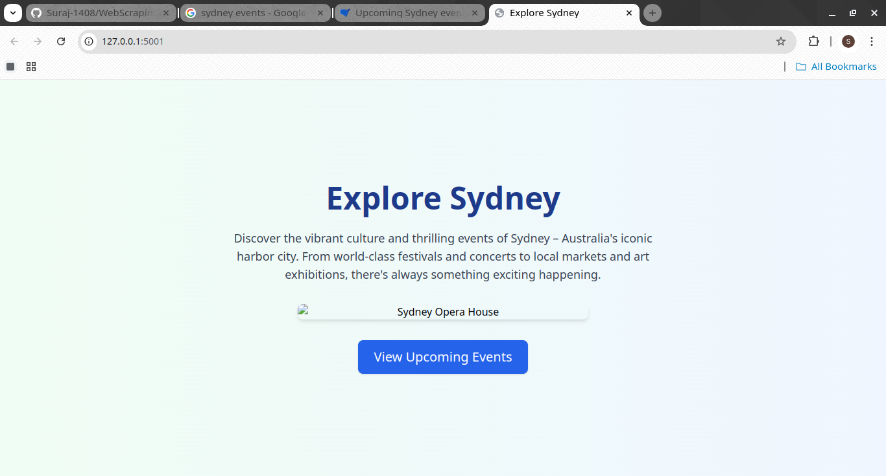
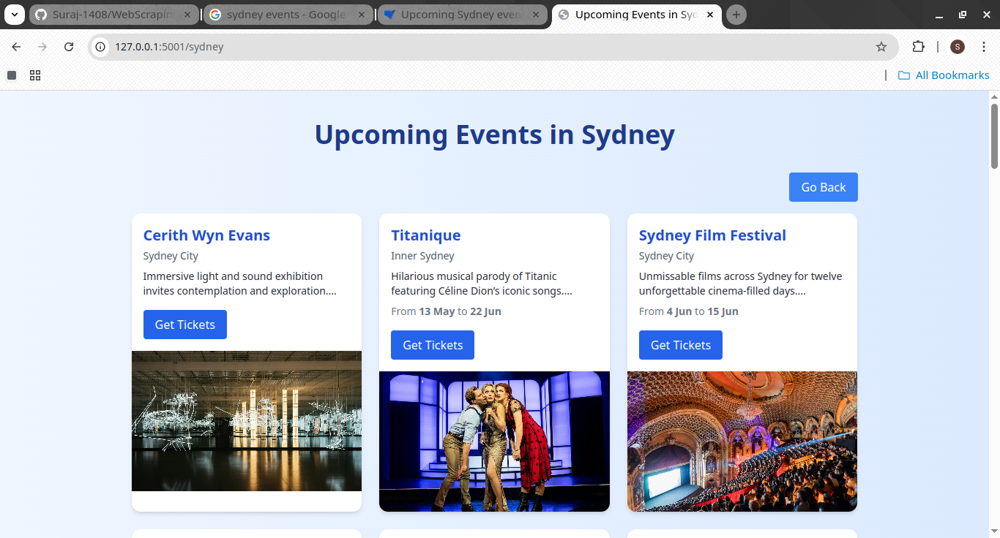
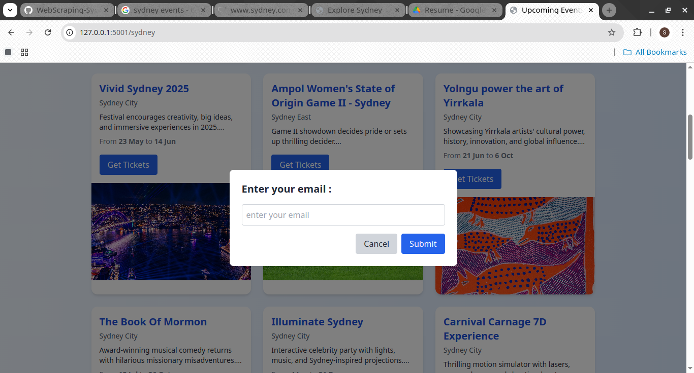
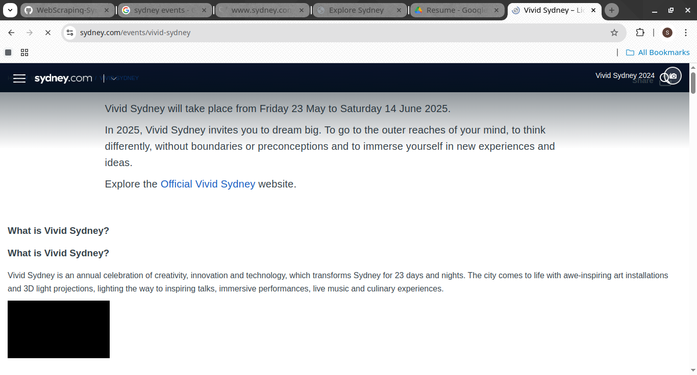

# WebScraping details of upcoming events in Sydney.

This is a simple web application that displays detailed information such as event title,event date,event description,URL and image by scraping from the Original Website -https://www.sydney.com/events .From orignal website I have scarped all upcoming events located inside section called "All events in Sydney". The data is collected and displayed with a clean, responsive interface.

## Features

- Scrapes upcoming events in Sydney
- Displays event details like title, location, description, date, and image
- Allows users to submit their email to get event tickets
- Stores submitted emails in a MySQL database

## Technologies Used

- Python (Flask)
- HTML, Tailwind CSS
- BeautifulSoup (for scraping)
- MySQL (for data storage)


## Preview of Application.
1) HomePage


2) All events


3) Email Input to get Ticket


4) On Submit - redirecting to original website



 

## Setup Instructions to run Locally
### 1. Clone the Repository
```
git clone https://github.com/Suraj-1408/WebScraping-Sydney-Events.git
```

### 2. Install Dependencies
Install the required packages present inside requirement.txt using pip command

### 3. Set Up MySQL Database

1)Start your MySQL server and log in:
Create a new database.

```
CREATE DATABASE events_db;
USE events_db;
```

2) create tables.
```
CREATE TABLE events (
    id INT PRIMARY KEY AUTO_INCREMENT,
    title VARCHAR(255),
    location VARCHAR(255),
    description TEXT,
    start_date VARCHAR(50),
    end_date VARCHAR(50),
    url VARCHAR(2048) UNIQUE,
    img_url TEXT
);
```

```
CREATE TABLE emails (
    id INT PRIMARY KEY AUTO_INCREMENT,
    email VARCHAR(255),
    event_id INT,
    timestamp TIMESTAMP DEFAULT CURRENT_TIMESTAMP
);
```

3) Update you db.py & app.py accordingly
  ```
mydb = mysql.connector.connect(
    host="localhost",
    user="your_mysql_username",
    password="your_mysql_password",
    database="events_db"
)
```

4) Run the Flask main app i.e app.py
Switch to virtual environment
  ```
    source venv/bin/activate 
  ```

Run the app.py
```
python3 app.py
```
